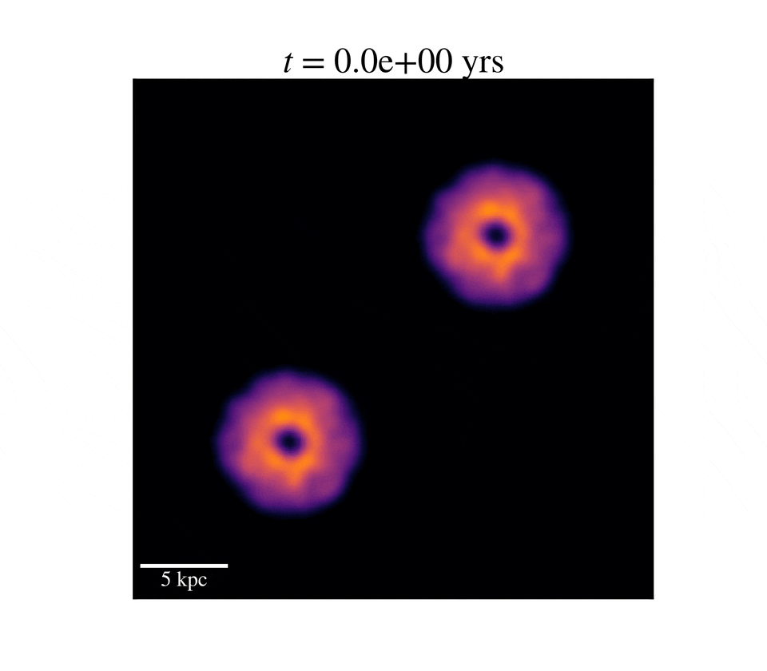
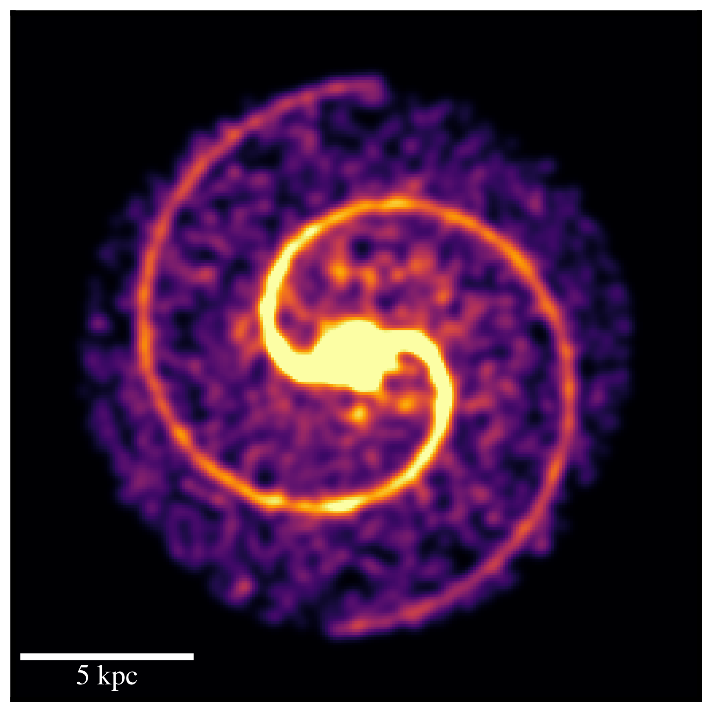
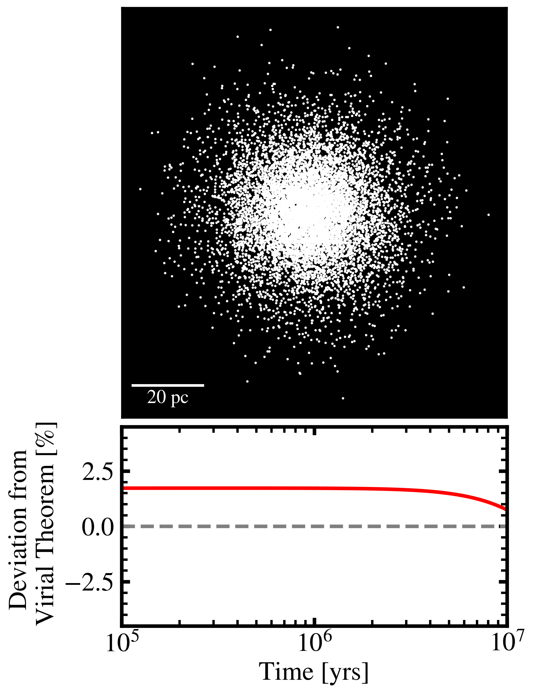

# LAMAR

LAMAR: Leapfrog-based time Advancement for Multibody
Astrophysical Rendering with GPUs.

This code was built for the Astro 513 - Planetary and Galactic Dynamics course at Princeton University. To run the code, first one needs an NVIDIA GPU capable of running CUDA. Once the `cudatoolkit` software is installed, compile the code by running 

`nvcc -lm lamar.cu -o lamar_exe -lm -O2`

on the terminal in the `src/` directory. This will generate the `lamar_exe` executable file. Then head on over to the `notebooks` directory and use the `generate_initial_conditions.ipynb` notebook to create a initialization file that can be directly passed into LAMAR. There are some premade initialization files in the `src/init_files` directory that can be run immediately. These are all remnants of the exploration phase of my project write up. If you are interested in understanding more of the details on what is included in LAMAR, feel free to look at the Final Project pdf. Lastly, if you wish to make movies or plot the results you can use the `movie_maker.ipynb` notebook or the `globular_cluster_analysis.ipynb` notebook to look more into how I created the figures for the writeup.

A simulation of two uniform disks merging

  

An image of a Spiral Galaxy simulated in LAMAR:

  

An image of the analysis of M15 which was simulated with LAMAR:

  

